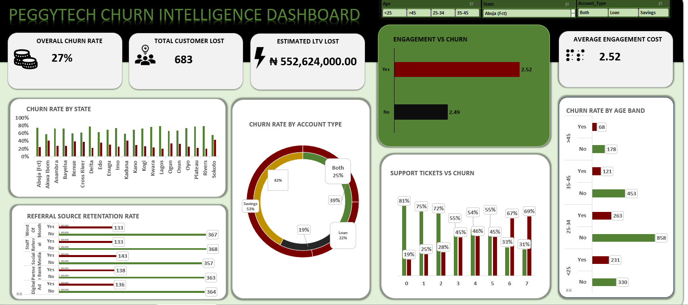

# Customer Churn Intelligence Dashboard

## The problem
A business was losing 27% of its customers and had no clear view of why. 
Churn was being reported as a single company-wide figure, making it 
impossible to see which customer segments were driving the loss and 
putting ₦552,624,000 in estimated lifetime value at risk.

## What I did
- Analysed 2,500+ customer records using PivotTables and advanced Excel formulas
- Calculated churn rate by segment rather than as one aggregate figure
- Built a fully interactive Excel dashboard with dynamic slicers for Age, State, and Account Type

## What I found
- Unresolved support tickets: churn rises from 19% to 69% — the primary driver
- Savings account holders: 53% churn vs 22% for loan customers — segment-specific risk
- ₦552,624,000 in estimated lifetime value exposed to the 27% overall churn rate

## Dashboard preview

## Tools used
Microsoft Excel | PivotTables | Advanced Formulas | Slicers

## Files in this repo
- customer_churn_dashboard.xlsx — the Excel workbook
- screenshots/ — dashboard images
